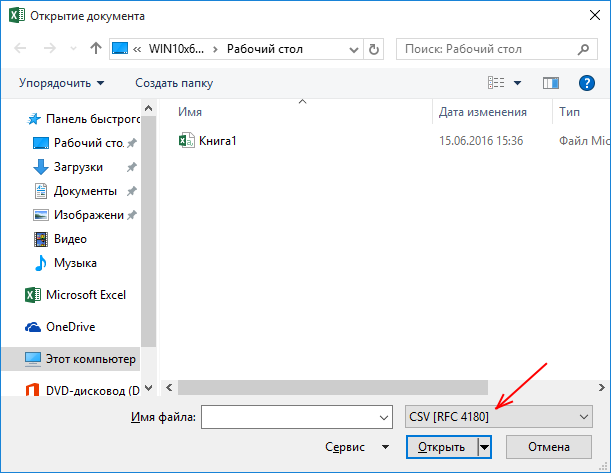
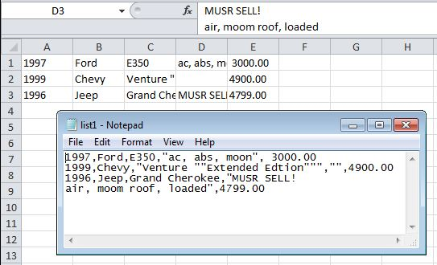
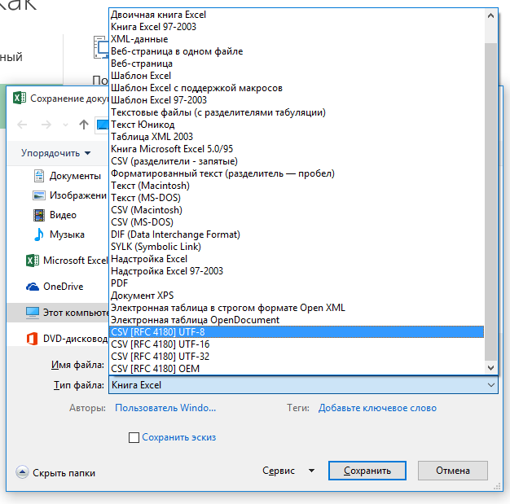

# The description of CSV 4180
The program CSV 4180 is an extension for Microsoft Excel and is designed to work with CSV files (Comma-Separated Values). CSV 4180 is integrated into Microsoft Excel and allows you to load and save data to an Excel spreadsheet from a CSV file according to the RFC 4180 standard.

# Opening a csv file in Excel
All data is loaded into Excel cells as string values according to RFC 4180.  

Thus, the csv file is converted to the correct table.  

# Saving Excel data to CSV
The CSV 4180 extension stores a Microsoft Excel spreadsheet in a csv file, according to the RFC 4180 standard.  

The data is stored as it is displayed in the cells themselves and is separated by commas.

----

# Build commands

Without signing:

    msbuild ./src/Release/Release.proj
    

With signing:

    msbuild /p:SignPassword=***** ./src/Release/Release.proj
